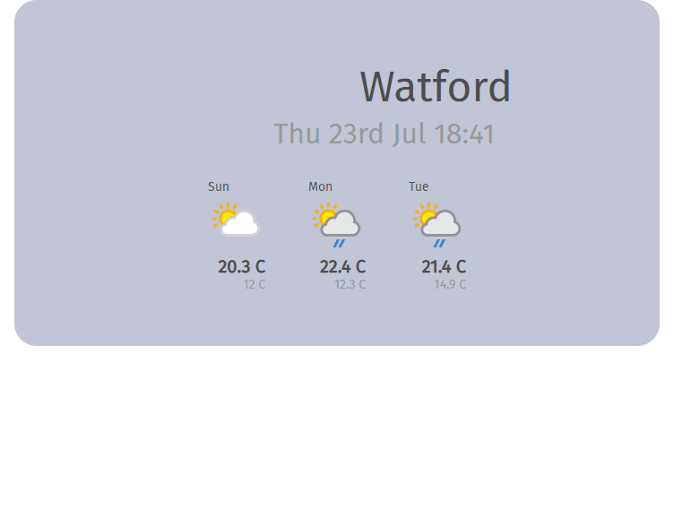

# Weather Forecast Widget

Simple Weather App that uses the [weatherapi](https://weatherapi.com) to load 
and display a weather forcasting widget.

Made as an exercise to learn VueJs and Vuex.



## Project setup
```
npm install
```

### Compiles and hot-reloads for development
```
npm run serve
```

### Compiles and minifies for production
```
npm run build
```

### Lints and fixes files
```
npm run lint
```

### Customize configuration
See [Configuration Reference](https://cli.vuejs.org/config/).
